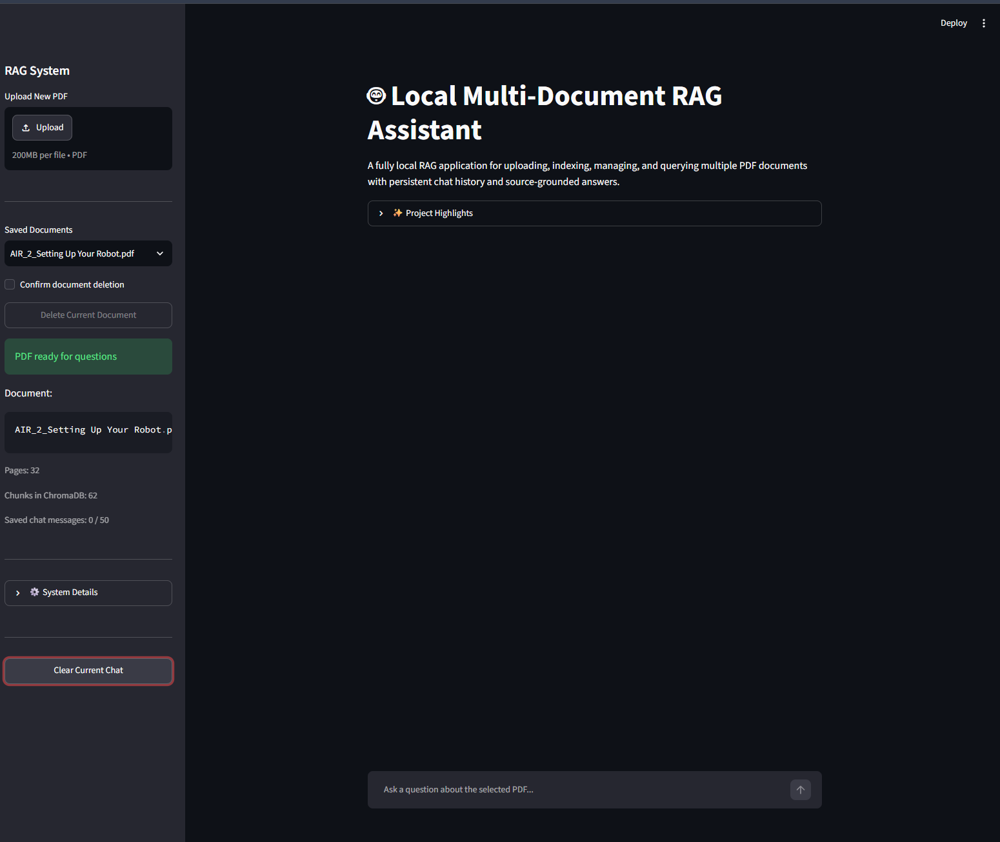

Local Multi-Document RAG Assistant

A fully local Retrieval-Augmented Generation (RAG) application for uploading, indexing, managing, and querying multiple PDF documents with persistent per-document chat history and source-grounded answers.

Application Screenshot

  

Features

Upload and manage multiple PDF documents

Persistent local document storage

Separate ChromaDB collection for each PDF

Persistent chat history for each document

Switch between documents without losing previous conversations

Source-grounded answers with page references and retrieved text

MMR (Maximal Marginal Relevance) retrieval

Short-chunk filtering to reduce low-value context

Local LLM inference with Ollama

Local embeddings with nomic-embed-text

RAGAS-based evaluation

Clear current chat and delete current document controls

No cloud API required for the core RAG pipeline

Tech Stack

Python 3.12

Streamlit

LangChain

Ollama

Llama 3.1 8B

nomic-embed-text

ChromaDB

PyPDF

RAGAS

Architecture

PDF Upload
   |
   v
Text Extraction (PyPDF)
   |
   v
Recursive Text Splitting
(chunk_size=500, overlap=100)
   |
   v
Local Embeddings
(nomic-embed-text)
   |
   v
ChromaDB
(separate persistent store per PDF)
   |
   v
MMR Retrieval
   |
   v
Retrieved Context + Page Metadata
   |
   v
Local LLM
(Llama 3.1 8B via Ollama)
   |
   v
Grounded Answer + Sources

Project Highlights

The application is designed as a general multi-document RAG system rather than a single-PDF demo. Each uploaded PDF is identified by a content hash, saved locally, indexed once, and assigned its own persistent vector database and chat history.

When the app is restarted, previously saved documents and conversations are restored automatically.

RAG Evaluation

RAGAS is used in a separate evaluation environment to avoid dependency conflicts with the main application environment.

Example evaluation result:

Faithfulness:       1.0000
Response Relevancy: 0.8931

Faithfulness measures whether the generated answer is supported by the retrieved context.

Response Relevancy measures how directly the generated response answers the user's question.

Installation

1. Clone the repository

git clone <YOUR-GITHUB-REPOSITORY-URL>
cd RAG_LangChain_Project

2. Create a virtual environment

Windows PowerShell:

python -m venv .venv
.\.venv\Scripts\Activate.ps1

3. Install Python dependencies

pip install -r requirements.txt

4. Install Ollama

Install Ollama on your system, then pull the required models:

ollama pull llama3.1:8b
ollama pull nomic-embed-text

You can verify the installed models with:

ollama list

Run the Application

python -m streamlit run app.py

Then open the local Streamlit URL shown in the terminal, usually:

http://localhost:8501

Run RAGAS Evaluation

Create a separate evaluation environment to avoid dependency conflicts with the main app:

python -m venv .venv_eval
.\.venv_eval\Scripts\python.exe -m pip install -r requirements-eval.txt

After the app has generated evaluation_sample.json, run:

.\.venv_eval\Scripts\python.exe .\evaluation\evaluate_rag.py

How to Use

Upload a PDF from the sidebar.

Wait until the document is indexed and marked ready.

Ask questions about the selected PDF.

Expand Sources to inspect the retrieved text and page numbers.

Upload additional PDFs and switch between them using Saved Documents.

Each document keeps its own chat history.

Use Clear Current Chat to clear only the selected document's conversation.

Use Delete Current Document to remove the selected PDF, its vector database, and its saved chat.

Local Data

The application stores runtime data locally in:

uploaded_pdfs/
chroma_uploads/
document_registry.json
chat_histories.json
evaluation_sample.json

These files are excluded from Git through .gitignore.

Current Limitations

Best suited for PDFs that contain extractable text.

Image-only or scanned PDFs are not yet processed with OCR.

Retrieval quality depends on the quality and structure of the source PDF.

The current implementation is designed for local use with Ollama.

Project Structure

RAG_LangChain_Project/
|
|-- app.py
|-- requirements.txt
|-- requirements-eval.txt
|-- .gitignore
|-- README.md
|-- assets/
|   `-- app_screenshot.png
|-- evaluation/
|   `-- evaluate_rag.py
|
|-- uploaded_pdfs/          # ignored by Git
|-- chroma_uploads/         # ignored by Git
|
|-- document_registry.json  # ignored by Git
|-- chat_histories.json     # ignored by Git
|-- evaluation_sample.json  # ignored by Git

Future Improvements

OCR support for scanned PDFs

Automated evaluation over a multi-question benchmark set

Optional reranking

Docker support

Improved document management UI

Exportable evaluation reports

Purpose

This project was built as a practical portfolio project to demonstrate hands-on experience with:

RAG system design

LangChain

Vector search

ChromaDB

Local LLM deployment

Embeddings

Retrieval optimization

RAG evaluation

Streamlit application development

Persistent local application state

Author

Mohammad Ahmad Elayyan
Intelligent Systems Engineering Graduate
GitHub: @MohammadElayyan117